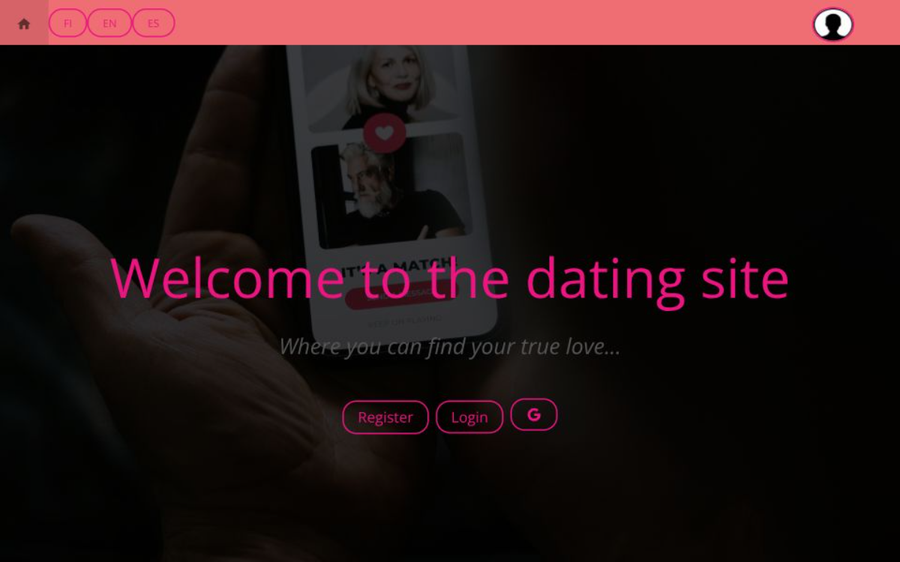

# dating_site_project



## Description of my project

Below I have tried to implement a social media platform where users can create an account, upload a profile picture, write a bio, and like/unlike other users.

Before going into the details of the project, I would like to mention that I have used the following technologies:
1. React for the frontend
2. Express for the backend
3. MongoDB for the database
4. Passport.js for authentication
5. Google OAuth for authentication
6. Multer for file uploads
7. React-Slick for the slider package
8. Materialize CSS for the frontend design (partly)
9. JWT for token generation
10. Bcrypt for password hashing
11. Mui to import some icons (home and google) …
  
---

## Local Development

After cloning the repository from GitHub, the `node_modules` directories are not included. Therefore, the dependencies need to be installed before running the application.

The project currently has several ways to run the application locally.

### 1. Run everything directly with Node/npm

First, install the backend dependencies:

```bash
cd root/server
npm install
````

Then start the backend:

```bash
npm start
```

In another terminal, install the frontend dependencies:

```bash
cd root/client
npm install
```

Then start the frontend:

```bash
npm start
```

The frontend runs on:

```text
http://localhost:3000
```

The backend runs on:

```text
http://localhost:1234
```

The backend requires the necessary environment variables to be configured in:

```text
root/server/.env
```

#### 1.1. Run both frontend and backend concurrently

I also have a root-level script that allows me to start both the frontend and backend concurrently.

First, make sure the dependencies are installed in both `root/server` and `root/client`. I also need to install the dependencies for the root-level scripts:

```bash
cd root
npm install
```

Then:

```bash
npm run dev
```

This starts both the frontend and backend concurrently.

---

### 2. Run the backend with Docker and the frontend with npm

The backend can be built and run using its Dockerfile.

From the server directory:

```bash
cd root/server
docker build -t dating-site-server .
```

Then run the container:

```bash
docker run -d --env-file .env -p 1234:1234 dating-site-server
```

The frontend can then be run normally:

```bash
cd root/client
npm install
npm start
```

The backend will be available at:

```text
http://localhost:1234
```

The frontend will be available at:

```text
http://localhost:3000
```

---

### 3. Run the backend with Docker Compose and the frontend with npm

I have also added a `docker-compose.yml` for local development.

Currently, only the backend is containerized.

The backend's environment variables are loaded from:

```text
root/server/.env
```

The Compose file passes this file to the backend using:

```yaml
env_file:
  - ./server/.env
```

From the project root:

```bash
cd root
```

Build and start the backend:

```bash
docker compose up --build -d server
```

The frontend can then be started separately:

```bash
cd client
npm install
npm start
```

The backend will be available at:

```text
http://localhost:1234
```

The frontend will be available at:

```text
http://localhost:3000
```

To stop the backend container:

```bash
docker compose down
```

To view the backend logs:

```bash
docker compose logs -f server
```

---

### 4. Run both frontend and backend with Docker Compose

This option will be available once I also containerize the frontend.

I have already added a `client` service to `docker-compose.yml`, but it currently expects a Dockerfile in:

```text
root/client/Dockerfile
```

Since the frontend is not containerized yet, I should currently start only the `server` service:

```bash
docker compose up --build -d server
```

Once I add a Dockerfile for the frontend, I can run both services from the project root with:

```bash
docker compose up --build
```

Or in detached mode:

```bash
docker compose up --build -d
```

At that point, both the frontend and backend will be managed by Docker Compose.

---

### Environment variables

The backend uses environment variables for sensitive information such as database credentials, JWT secrets, and OAuth credentials.

A `.env.example` file is included in `root/server` to show which variables are required.

After cloning the repository, create the local `.env` file:

```bash
cd root/server
cp .env.example .env
```

Then fill in the actual values.

The resulting file should be:

```text
root/server/.env
```

---

## Part 1: Backend
In the backend, I have created the following routes:
1.1 Get routes in gets.js:
- /api/user: To get the user details
- /api/all-users: To get all users from the database
- /api/user/like: To get the users whom the current user has liked- /api/chat: To get the chat messages between two users
- /api/user/image: To get the user’s image (if any)
- /api/auth/google: To initiate the Google OAuth process
- /api/auth/google/callback: To handle the Google OAuth callback
1.2 Post routes in posts.js:
- /api/user/login: To login a user
- /api/user/bio: To update the user's bio
- /api/user/like: To like/unlike a user
- /api/user/image: To add an image to the user
- /api/chat: To send a chat message
The most time-consuming part from these was making the updateLikedUsers function
which I directly supply to the /api/user/like route. More details about this function can be
found in posts.js.

## Part 2: Frontend
In the frontend, I have created the following components:
- App.js: The main component that holds the routing logic
- Header.js: The header component that contains the navigation links
- Login.js: The login component
- Register.js: The register component
- Chat.js: The chat component
- ChatWindow.js: where the chat messages are displayed
- Profile.js: The profile component
- AddImage.js: The add image component
- GoogleAuth.js: The Google OAuth component- Suggestions.js: The suggestions component
- UsersSlider.js: The users slider component
In the front page you will get 3 buttons: Register, Login, and Google Authenticate. On the
top, which stays there all the time, you will see the navigation links: Home, language
options and the user's profile picture (if logged in).
Let me start with the header logic:
- You can see everything on the header component. The header component is always
visible on the top of the page.
- But, when profile is clicked, there are 4 options: Profile, Add Image, Chat, and Logout.
- Of course, the first three address a logged in user, so even though you can click them
unlogged, you will be redirected to the login page.
Login and Register:
- These have basic implementations. The login page has a form with email and password
fields.
- The register page has a form with email, password, and name fields.
- Successful login redirects to suggestions page, which contains the sliders of all users.
- Successful register redirects to the login page.
Dropdown menus on the header:
1. My Profile:
- When clicked, the user is redirected to the profile page.
- You can see the user's name, email, bio, and profile picture & date of registration.
- There is an option to update the bio.2. Add Image:
- When clicked, the user is redirected to the add image page.
3. Chat:
- When clicked, the user is redirected to the chat page.
- The chat page has a list of users with whom the current user has chatted. And empty chat
window.
- the chat window is updated when a user is clicked.
- In the chat window you can see the name of the user you are chatting with, and the
messages.
- Additionally, you can search for a text in the messages.
4. Logout:
- When clicked, the user is logged out and redirected to the login page.
Google Authentication:
- When clicked, the user is redirected to the Google OAuth page.
- After successful authentication, the user is redirected to the suggestions page.
Suggestions:
- The suggestions page contains a slider of all users.
- You can like/unlike a user by clicking the heart icon.
- By clicking expand, you can see the whole bio or name if it was too long and was cut off.
